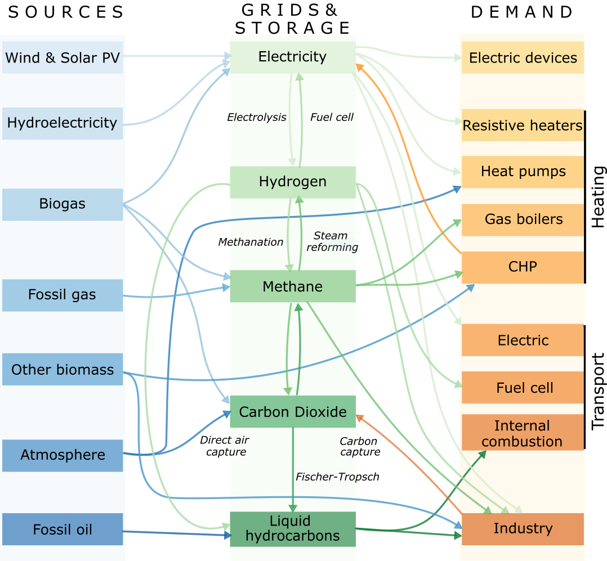

# PyPSA-Eur-Sec: A Sector-Coupled Open Optimisation Model of the European Energy System


**WARNING**: This model is under construction and contains serious
problems that distort the results. See the github repository
[issues](https://github.com/PyPSA/pypsa-eur-sec/issues) for some of
the problems (please feel free to help or make suggestions). There is
neither documentation nor a paper yet, but we hope to have a preprint
out by summer 2020. We cannot support this model if you choose to use
it.


PyPSA-Eur-Sec builds on the electricity generation and transmission
model [PyPSA-Eur](https://github.com/PyPSA/pypsa-eur) to add demand
and supply for the following sectors: transport, space and water
heating, biomass, industry and industrial feedstocks. This completes
the energy system and includes all greenhouse gas emitters except
waste management, agriculture, forestry and land use.

This diagram gives an overview of the sectors and the links between
them:




PyPSA-Eur-Sec was initially based on the model PyPSA-Eur-Sec-30 described
in the paper [Synergies of sector coupling and transmission
reinforcement in a cost-optimised, highly renewable European energy
system](https://arxiv.org/abs/1801.05290) (2018) but it differs by
being based on the higher resolution electricity transmission model
[PyPSA-Eur](https://github.com/PyPSA/pypsa-eur) rather than a
one-node-per-country model, and by including biomass, industry,
industrial feedstocks, aviation, shipping, better carbon management,
carbon capture and usage/sequestration, and gas networks.


PyPSA-Eur-Sec includes PyPSA-Eur as a
[snakemake](https://snakemake.readthedocs.io/en/stable/index.html)
[subworkflow](https://snakemake.readthedocs.io/en/stable/snakefiles/modularization.html#snakefiles-sub-workflows). PyPSA-Eur-Sec
uses PyPSA-Eur to build the clustered transmission model along with
wind, solar PV and hydroelectricity potentials and time series. Then
PyPSA-Eur-Sec adds other conventional generators, storage units and
the additional sectors.

Currently the scripts to solve and process the resulting PyPSA models
are also included in PyPSA-Eur-Sec, although they could in future be
better integrated with the corresponding scripts in PyPSA-Eur. A
stumbling block to sharing solve_network.py between PyPSA-Eur and
PyPSA-Eur-Sec is the different extra_functionality required to build
storage and CHP constraints.

# Spatial resolution of sectors

Not all of the sectors are at the full nodal resolution, and some are
distributed to nodes using heuristics that need to be corrected. Some
networks are copper-plated to reduce computational times.

For example:

Electricity network: nodal.

Electricity demand: nodal, distributed in each country based on
population and GDP.

Building heating demand: nodal, distributed in each country based on
population.

Industry demand: nodal, distributed in each country based on
population (will be corrected to real locations of industry, see
github issue).

Hydrogen network: nodal.

Methane network: copper-plated for Europe, since future demand is so
low and no bottlenecks are expected.

Solid biomass: copper-plated until transport costs can be
incorporated.

CO2: copper-plated (but a transport and storage cost is added for
sequestered CO2).

Liquid hydrocarbons: copper-plated since transport costs are low.


# Installation

First install [PyPSA-Eur](https://github.com/PyPSA/pypsa-eur) and all
its dependencies. Clone the repository:
```shell
projects % git clone git@github.com:PyPSA/pypsa-eur.git
```
then download and unpack all the data files.

Create a parallel directory for PyPSA-Eur-Sec with:
```shell
projects % git clone git@github.com:nworbmot/pypsa-eur-sec.git
```

## Package requirements

The requirements are the same as
[PyPSA-Eur](https://github.com/PyPSA/pypsa-eur), but for
`solve_network.py` in addition you need `gurobipy` and version 0.16.1
or greater of PyPSA in order to use the `nomopyomo` framework.

## Data requirements

The data requirements include the JRC-IDEES-2015 database, JRC biomass
potentials, EEA emission statistics, Eurostat Energy Balances, urban
district heating potentials, emobility statistics, timezone mappings
and heating profiles.

The data bundle is about 640 MB.

To download and extract it on the command line:
```shell
projects/pypsa-eur-sec/data % wget "https://nworbmot.org/pypsa-eur-sec-data-bundle-190719.tar.gz"
projects/pypsa-eur-sec/data % tar xvzf pypsa-eur-sec-data-bundle-190719.tar.gz
```
